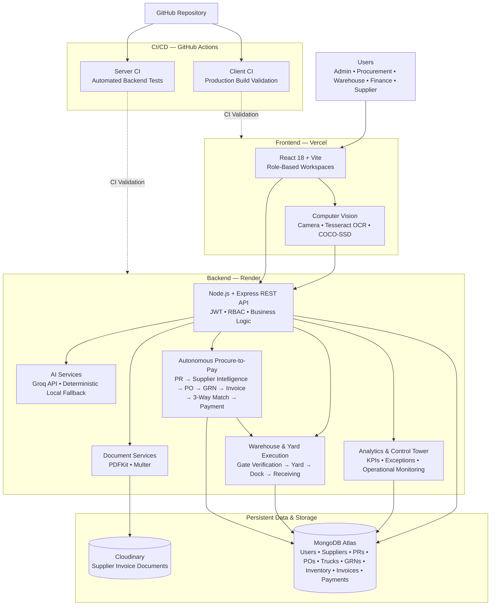

# CogniYard

**AI-Enabled Procure-to-Pay and Yard/Dock Execution Platform**

CogniYard is a full-stack supply-chain platform that connects procurement, supplier collaboration, warehouse operations, yard execution, finance, and analytics in a single application.

The platform covers the complete workflow from **Purchase Requisition and Purchase Order to Truck Arrival, Goods Receipt, Supplier Invoice, 3-Way Matching, and Payment**.

**Current Version:** v2.3.1 — Verified Corrections

---

## Overview

CogniYard is designed to demonstrate how AI, computer vision, document processing, workflow automation, and persistent enterprise data can be combined to improve supply-chain execution.

The platform provides dedicated workflows for:

* Procurement
* Warehouse and Yard Operations
* Supplier Management
* Finance
* Administration
* Analytics and Operational Monitoring

---

## Architecture Overview



---

## Key Features

### Role-Based Access

CogniYard supports dedicated workspaces for:

* Admin
* Procurement Manager
* Warehouse/Dock Manager
* Finance
* Supplier

Access is protected through authentication, role-based authorization, route protection, and supplier ownership controls.

### Procurement

* Purchase requisition creation and approval
* Supplier selection
* Purchase order generation
* Supplier Chain Matrix
* Quantity and unit-price tracking
* AI-assisted procurement actions
* Persistent procurement records

The procurement workflow connects:

**PR → PO → GRN → Invoice → 3-Way Match → Payment**

### Warehouse and Yard Operations

* Truck gate verification
* Browser-based camera and OCR workflow
* License plate verification
* Driver ID verification
* Dock recommendation and assignment
* Yard truck simulation
* Goods receiving
* Goods Receipt Notes
* Inventory updates
* Dock availability tracking

Gate verification is enforced before the truck can proceed to the yard and receiving workflow.

### Supplier Portal

Suppliers can:

* View assigned purchase orders
* Generate PDF invoices
* Upload invoice documents
* Edit submitted invoices
* Replace invoice documents
* Update invoice number, date, quantities, prices, tax, and shipping

Supplier access is restricted to their assigned purchase orders and invoices.

### Finance and 3-Way Matching

Finance users can review supplier invoices and perform 3-way matching between:

* Purchase Order
* Goods Receipt Note
* Supplier Invoice

Matching validates supplier, PO number, items, quantities, unit prices, and subtotal.

Fully matched invoices become eligible for payment. Partial or failed matches are placed on payment hold for review.

### Dashboards and Monitoring

Role-specific dashboards provide operational KPIs for:

* Procurement
* Warehouse
* Finance
* Administration

Admin users also have access to:

* Control Tower
* Exception Center
* Inventory Planning
* Smart CCTV

### AI and Computer Vision

The platform includes:

* Groq-powered AI assistance
* Deterministic local AI fallback
* Browser camera integration
* Tesseract OCR
* TensorFlow.js COCO-SSD object detection

### Invoice Documents

Invoice processing supports:

* PDF generation
* Invoice uploads
* Invoice replacement
* Cloudinary storage
* Local demo storage
* File size validation
* MIME-type validation
* File signature/content validation

---

## End-to-End Workflow

1. Admin creates or manages suppliers.
2. Procurement creates and approves a purchase requisition.
3. The approved requisition is converted into a purchase order.
4. Warehouse verifies the arriving truck using the gate workflow.
5. The truck proceeds through yard and dock assignment.
6. Warehouse receives the goods and creates the GRN.
7. Supplier generates or uploads an invoice against the PO.
8. Finance reviews the invoice and performs 3-way matching.
9. A matched invoice becomes payment-eligible; exceptions are placed on hold.
10. Dashboards and operational views reflect the resulting activity.

---

## Technology Stack

| Layer                           | Technology                                                                                      |
| ------------------------------- | ----------------------------------------------------------------------------------------------- |
| **Frontend**                    | React 18, Vite, Tailwind CSS                                                                    |
| **Frontend Hosting**            | **Vercel**                                                                                      |
| **Routing**                     | React Router                                                                                    |
| **Charts**                      | Recharts                                                                                        |
| **Maps**                        | React Leaflet                                                                                   |
| **Backend**                     | Node.js 20+, Express                                                                            |
| **Backend Hosting**             | **Render**                                                                                      |
| **Database**                    | **MongoDB Atlas, Mongoose**                                                                     |
| **Authentication**              | JWT, bcrypt, RBAC                                                                               |
| **AI / Copilot**                | **Groq API + deterministic local fallback**                                                     |
| **AI Procurement Intelligence** | Natural-language extraction, supplier scoring, EOQ validation, autonomous PR → PO orchestration |
| **Computer Vision**             | TensorFlow.js, COCO-SSD                                                                         |
| **OCR**                         | Tesseract                                                                                       |
| **Documents**                   | PDFKit, Multer                                                                                  |
| **File Storage**                | **Cloudinary**                                                                                  |
| **Testing**                     | Node.js Test Runner                                                                             |
| **CI/CD**                       | **GitHub Actions**                                                                              |
| **Client CI**                   | Automated Vite production build validation                                                      |
| **Server CI**                   | Automated backend test validation                                                               |
| **API**                         | REST API                                                                                        |
| **Build Tool**                  | Vite                                                                                            |
| **Version Control**             | Git, GitHub                                                                                     |


---

## Project Structure

```text
CogniYard/
├── client/                              # React + Vite frontend
│   ├── public/
│   └── src/
│       ├── components/                  # Reusable UI & Copilot components
│       ├── context/                     # Auth, theme & application state
│       ├── pages/                       # Procurement, Logistics, Finance, etc.
│       └── services/                    # API service integrations
│
├── server/                              # Node.js + Express backend
│   ├── controllers/                     # Business logic & API controllers
│   ├── middleware/                      # Auth, RBAC & file-upload middleware
│   ├── models/                          # MongoDB/Mongoose models
│   ├── routes/                           # REST API routes
│   ├── seed/                             # Demo/bootstrap data
│   ├── services/                         # AI, procurement & document services
│   └── tests/                            # Backend & integration tests
│
├── docs/
│   └── IMPLEMENTATION_REPORT.md          # Detailed implementation & verification report
│
├── .github/
│   └── workflows/
│       ├── client-ci.yml                 # Frontend build CI
│       └── server-ci.yml                 # Backend test CI
│
├── .env.example                          # Environment variable template
├── .gitignore
├── package.json                          # Root workspace configuration
├── package-lock.json
├── README.md
└── START_COGNIYARD_WINDOWS.bat           # Windows development launcher
```

`node_modules` and environment files containing secrets are excluded from version control.

---

## Quick Start

### Requirements

* Node.js 20 or newer
* npm
* MongoDB Community Server or MongoDB Atlas
* Chrome or Edge for camera/OCR functionality

### 1. Configure Environment

For local development, create `.env` from the example file.

Windows PowerShell:

```powershell
Copy-Item .env.example .env
```

macOS/Linux:

```bash
cp .env.example .env
```

At minimum:

```env
DATABASE_URL=mongodb://127.0.0.1:27017/cogniyard
JWT_SECRET=replace_with_a_long_random_secret
```

Optional integrations include:

* Groq AI
* Cloudinary
* Google Sign-In

Never commit real secrets or `.env` files to GitHub.

### 2. Install Dependencies

From the project root:

```bash
npm install
```

Prepare demo data:

```bash
npm run bootstrap
```

`bootstrap` safely prepares demo data without intentionally clearing existing business records.

### 3. Start the Application

```bash
npm run dev
```

Development frontend:

```text
http://localhost:3000
```

---

## Deployment

CogniYard is deployed using a cloud-based application architecture:

| Component | Platform |
| --- | --- |
| Frontend | **Vercel** |
| Backend API | **Render** |
| Database | **MongoDB Atlas** |
| Invoice Document Storage | **Cloudinary** |
| Source Control | **GitHub** |
| Continuous Integration | **GitHub Actions** |

The React frontend communicates with the deployed Express REST API through the configured `VITE_API_URL`.

The Render backend connects to MongoDB Atlas for persistent business data and Cloudinary for supplier invoice documents.

### Deployment Architecture

```text
User
  │
  ▼
Vercel
React + Vite Frontend
  │
  │ HTTPS / REST API
  ▼
Render
Node.js + Express Backend
  │
  ├──────────────► MongoDB Atlas
  │
  ├──────────────► Cloudinary
  │
  └──────────────► Groq API
```

### Production Environment

The deployed backend requires environment variables such as:

```env
NODE_ENV=production
DATABASE_URL=...
JWT_SECRET=...
CLIENT_URL=...
CLOUDINARY_REQUIRED=true
```

The deployed frontend requires:

```env
VITE_API_URL=...
```

Actual secret values are configured through the respective deployment platforms and are never committed to the repository.

---

## Windows One-Click Start

Windows users can run:

```text
START_COGNIYARD_WINDOWS.bat
```

The startup script prepares the environment, installs dependencies, bootstraps demo accounts, starts the backend and frontend, and opens the verified local application.

Verified local URL:

```text
http://127.0.0.1:3101
```

MongoDB must be running locally when using the local development configuration.

---

## Demo Accounts

All seeded demo accounts use:

```text
password123
```

| Role | Email |
| --- | --- |
| Admin | `admin@cogniyard.com` |
| Procurement Manager | `procurement@cogniyard.com` |
| Warehouse/Dock Manager | `warehouse@cogniyard.com` |
| Finance | `finance@cogniyard.com` |
| Supplier | `supplier@cogniyard.com` |

The login page also provides quick-access options for the seeded demo roles.

> **Demo note:** These credentials are intended only for the hackathon demonstration environment. They must not be used as production credentials.

---

## Useful Commands

| Command | Purpose |
| --- | --- |
| `npm install` | Install project dependencies |
| `npm run bootstrap` | Prepare demo data safely |
| `npm run dev` | Start frontend and backend locally |
| `npm run build` | Build the frontend |
| `npm test` | Run backend tests and frontend production build |
| `npm start` | Start the production backend |
| `npm run seed` | Reset and reseed development data |

Use `npm run seed` only when intentionally rebuilding the development dataset.

---

## Environment Variables

| Variable | Required | Description |
| --- | --- | --- |
| `DATABASE_URL` | Yes | MongoDB connection string |
| `JWT_SECRET` | Yes | JWT signing secret |
| `JWT_EXPIRES_IN` | No | JWT lifetime; defaults to `7d` |
| `PORT` | No | Backend port; defaults to `5000` |
| `CLIENT_URL` | Production | Deployed Vercel frontend origin allowed by backend CORS |
| `ALLOW_PUBLIC_REGISTRATION` | No | Enables/disables public registration |
| `DEMO_ACCOUNTS_ENABLED` | No | Enables demo account bootstrap |
| `GROQ_API_KEY` | No | Groq AI integration |
| `GROQ_MODEL` | No | Groq model configuration |
| `CLOUDINARY_URL` | No | Cloudinary connection string |
| `CLOUDINARY_CLOUD_NAME` | No | Cloudinary cloud name |
| `CLOUDINARY_API_KEY` | No | Cloudinary API key |
| `CLOUDINARY_API_SECRET` | No | Cloudinary API secret |
| `CLOUDINARY_INVOICE_FOLDER` | No | Cloudinary invoice storage folder |
| `CLOUDINARY_REQUIRED` | No | Forces invoice documents to use Cloudinary |
| `GOOGLE_CLIENT_ID` | No | Google authentication configuration |
| `VITE_GOOGLE_CLIENT_ID` | No | Browser Google Sign-In configuration |
| `VITE_API_URL` | Production | Deployed Render backend API URL |
| `VITE_PORT` | No | Local Vite frontend port |
| `VITE_API_TARGET` | No | Local Vite API proxy target |
| `VITE_APP_VERSION` | No | Application version label |
| `BUYER_COMPANY_NAME` | No | Buyer name for generated invoices |
| `BUYER_ADDRESS` | No | Buyer address for generated invoices |

Never commit real `.env` files, API keys, database credentials, JWT secrets, or other production secrets.

---

## Invoice Uploads

Supplier invoice processing supports:

```text
PDF, JPG, JPEG, PNG, WEBP, HTML, HTM,
DOC, DOCX, XLS, XLSX, CSV
```

Maximum file size:

```text
10 MB
```

Uploaded files are validated using:

* File extension
* MIME type
* File size
* File signature/content validation

Executable files and disguised executable files are rejected.

### Invoice Document Lifecycle

```text
Supplier
   │
   ▼
Upload / Generate Invoice
   │
   ▼
File Validation
   │
   ▼
Cloudinary
   │
   ▼
Invoice Record
   │
   ▼
Finance Review
   │
   ▼
3-Way Match
```

Cloudinary is the preferred document-storage provider for the deployed environment. Local storage remains available as a development/demo fallback when configured.

---

## Continuous Integration

CogniYard uses **GitHub Actions** for automated CI validation.

Two independent workflows are maintained:

```text
.github/
└── workflows/
    ├── client-ci.yml
    └── server-ci.yml
```

### Server CI

The server workflow:

1. Installs backend dependencies.
2. Runs the Node.js backend test suite.
3. Validates backend functionality and regression coverage.

### Client CI

The client workflow:

1. Installs frontend dependencies.
2. Runs the Vite production build.
3. Verifies that the frontend compiles successfully.

### Current Verification

The current backend test suite contains:

```text
31 tests
31 passed
0 failed
```

Coverage includes areas such as:

* AI procurement parsing
* Procurement intelligence
* Supplier recommendation
* PR → PO conversion
* Logistics Copilot routing
* RBAC enforcement
* Invoice processing
* Document validation
* OCR and gate verification
* 3-way matching
* Payment controls
* Cloudinary/local document handling
* Regression scenarios

The production frontend build also completes successfully.

---

## Production-Like Run

To validate the frontend locally:

```bash
npm run build
```

To start the backend in production mode:

```bash
npm start
```

Required production environment variables include:

```env
NODE_ENV=production
DATABASE_URL=...
JWT_SECRET=...
CLIENT_URL=...
```

For deployed invoice processing:

```env
CLOUDINARY_REQUIRED=true
```

This ensures invoice documents use Cloudinary rather than relying on local server storage.

The production deployment is hosted using:

```text
Frontend  → Vercel
Backend   → Render
Database  → MongoDB Atlas
Documents → Cloudinary
```

---

## Troubleshooting

| Problem | Solution |
| --- | --- |
| Application loads but data is unavailable | Verify MongoDB/Atlas connectivity and `DATABASE_URL` |
| Invalid demo credentials | Run `npm run bootstrap` |
| `ECONNREFUSED 127.0.0.1:27017` | Start MongoDB or use the MongoDB Atlas connection string |
| Port 5000 is already in use | Stop the existing Node process or change `PORT` |
| CORS error in deployed frontend | Verify `CLIENT_URL` matches the deployed Vercel origin |
| Frontend cannot reach backend | Verify `VITE_API_URL` points to the deployed Render API |
| Cloudinary configuration error | Verify Cloudinary environment variables |
| Invoice upload fails | Check file type, file size, MIME type, and Cloudinary configuration |
| Camera does not open | Use Chrome/Edge and allow camera permissions |
| OCR model does not load | Refresh after establishing an internet connection |
| Groq AI is unavailable | Configure `GROQ_API_KEY`; deterministic local fallback remains available |
| GitHub Actions server CI fails | Open the Server CI workflow and inspect the failed backend test |
| GitHub Actions client CI fails | Open the Client CI workflow and inspect the Vite build output |
| Old frontend keeps opening locally | Close old tabs and use `http://127.0.0.1:3101` for the verified local build |

---

## Testing

### Run the Complete Test and Build Validation

From the project root:

```bash
npm test
```

The root test command executes:

```text
Server Tests
     │
     ▼
31+ Backend Tests
     │
     ▼
Client Production Build
     │
     ▼
Vite Build Validation
```

### Backend Tests Only

```bash
npm run test --workspace server
```

### Frontend Build Only

```bash
npm run build --workspace client
```

The test suite validates areas including:

* AI procurement parsing
* Procurement intelligence
* Supplier recommendation
* EOQ validation
* PR creation
* PR → PO conversion
* Shipment and Truck lifecycle creation
* Logistics Copilot
* Finance Copilot
* RBAC
* Invoice processing
* Document storage
* File uploads
* Gate verification
* OCR processing
* 3-way matching
* Payment controls
* Regression scenarios

---

## Demo and Simulation Notes

CogniYard is a hackathon demonstration platform. Some physical-world capabilities are simulated because the development environment does not provide live warehouse hardware, GPS devices, production CCTV infrastructure, or real logistics partners.

### Simulated Components

The following capabilities use controlled simulation or seeded telemetry:

* GPS truck movement
* Physical yard telemetry
* Fixed-yard camera associations
* Certain logistics events

### Persisted Application Workflows

Core business workflows use persistent backend data:

* Authentication
* Users
* Suppliers
* Purchase requisitions
* Purchase orders
* Shipments
* Trucks
* Gate verification
* Dock assignments
* Goods receipts
* Inventory
* Supplier invoices
* Invoice documents
* 3-way matching
* Payments
* Exceptions
* Dashboards
* Analytics
* AI procurement recommendations
* Role enforcement

This allows CogniYard to demonstrate a realistic end-to-end supply-chain workflow while clearly separating simulated physical infrastructure from persisted enterprise business data.

---

## End-to-End Demo Flow

The recommended demonstration flow is:

```text
Natural-Language Requirement
          │
          ▼
Supply-Chain Copilot
          │
          ├── SKU Resolution
          ├── Quantity / Price Extraction
          ├── Priority & Business Reason
          ├── Supplier Intelligence
          └── EOQ Validation
          │
          ▼
Human Approval
          │
          ▼
Purchase Requisition
          │
          ▼
Purchase Order
          │
          ├── Shipment Created
          └── Truck Created
                    │
                    ▼
              Gate Verification
                    │
                    ▼
              Yard / Dock Assignment
                    │
                    ▼
                Goods Receipt
                    │
                    ▼
                  GRN
                    │
                    ▼
             Supplier Invoice
                    │
                    ▼
              3-Way Matching
          ┌─────────┴─────────┐
          ▼                   ▼
       MATCHED             MISMATCH
          │                   │
          ▼                   ▼
 Payment Eligible        Payment ON HOLD
```

This demonstrates the connection between the **AI procurement layer, operational yard execution, and autonomous Procure-to-Pay workflow**.

---

## Documentation

Additional implementation and verification details are available in:

```text
docs/IMPLEMENTATION_REPORT.md
```

The repository also contains the GitHub Actions CI workflows:

```text
.github/workflows/client-ci.yml
.github/workflows/server-ci.yml
```

---

## Project Status

**CogniYard v2.3.1 — Verified Corrections**

The current deployed build includes:

* Role-based workspaces
* Supplier ownership controls
* AI Supply-Chain Copilot
* Natural-language procurement intelligence
* SKU/product resolution
* Supplier intelligence and scoring
* EOQ-based procurement validation
* Human approval safeguards
* AI-assisted PR creation
* AI-assisted PR → PO conversion
* Automatic Shipment and Truck lifecycle creation
* Procurement workflow
* Purchase orders
* Gate verification
* Browser-camera OCR
* Yard and dock simulation
* Dock recommendation
* Goods receiving and GRNs
* Inventory updates
* Supplier invoice generation and uploads
* Cloudinary invoice document storage
* Finance invoice review
* 3-way matching
* Payment workflow
* Payment hold controls
* Logistics Copilot
* Finance Copilot
* Operational dashboards
* Control Tower
* Exception Center
* Inventory Planning
* Smart CCTV
* MongoDB Atlas persistence
* Vercel frontend deployment
* Render backend deployment
* GitHub Actions CI
* Automated Windows startup
* Backend test suite
* Production frontend build

---

## License

This project was developed as a hackathon solution and demonstration platform.

For implementation details, architecture information, and verification notes, refer to:

```text
docs/IMPLEMENTATION_REPORT.md
```
