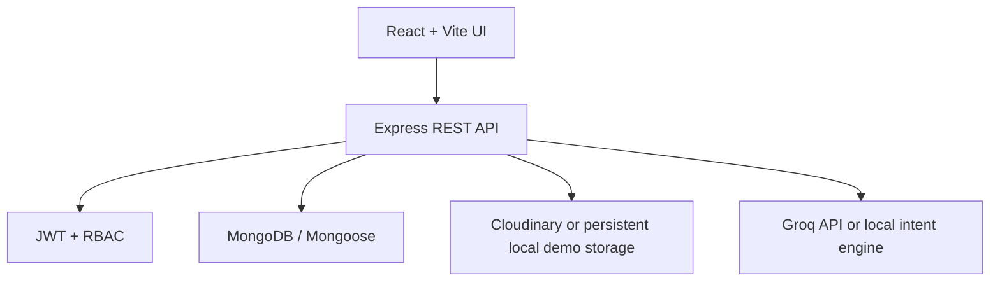
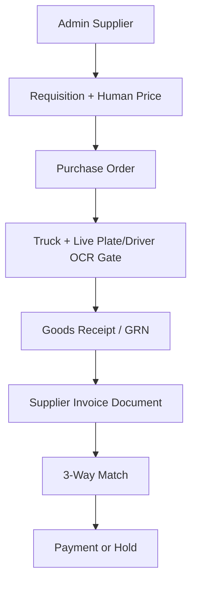

# CogniYard

CogniYard is a connected Procure-to-Pay (PR2) and Yard/Dock Execution (E2) web application. This version extends the original project instead of replacing it: the existing React design, pages, maps, simulation, procurement flow, and MongoDB models are preserved while supplier onboarding, real invoices, 3-way matching, role security, dashboards, and startup have been connected end-to-end.

## Verified Corrections Build v2.3.1

This release uses a dedicated one-click Windows address, `http://127.0.0.1:3101`, and displays a visible **Verified corrections v2.3.1** badge. This prevents an older process on port 3000 from being mistaken for the corrected application.

- Every screen, form, table, and action is centre aligned.
- Admin sees all management modules and supervision tools.
- Procurement, Warehouse, Finance, and Supplier users see only the dashboard and tools required for their own job.
- Admin-only pages are protected at the route level, so a manager cannot open a hidden module with a direct URL.
- Redundant role instructions and “only your work” banners were removed to keep each screen focused.
- Demo users can enter a role workspace with one click from the login screen.
- Warehouse has two separate workspaces: automatic gate verification and intelligent yard truck simulation.
- Supplier invoice upload is one action: document storage, database save, and Finance handoff happen automatically. Cloudinary is used whenever it is configured; a persistent local demo store prevents the hackathon workflow from being blocked when credentials are absent.
- Finance cannot upload a replacement invoice. It fetches only the latest submitted supplier invoice linked to that PO.
- The former full-page moving background was removed; light mode is white and dark mode is black.
- Warehouse has real live-camera OCR for number plate and driver-ID serial matching. Dock and receiving actions stay locked until both checks pass.
- Gate verification shows one real browser-camera feed and at least three clearly labelled dock-camera placeholders, expanding with the dock count.
- The existing TensorFlow.js/COCO-SSD object-detection engine remains unchanged and runs continuously over the same camera feed.
- Supplier invoices can be edited after submission; lines, quantities, prices, tax, shipping, invoice number/date, and document are refreshed in Finance and matching resets safely.
- All operational charts use persisted records and show professional distribution names, axis labels, value labels, legends, and no-data states.

## What works

- Admin supplier management with persistent supplier IDs, portal accounts, status, edit, and safe deletion.
- Dynamic Supplier Chain Matrix backed by the same MongoDB supplier records.
- Human-entered quantity and price per unit; no AI/fixed-price fallback.
- Actual price propagation through PR, PO, GRN, invoice, finance, match, and analytics.
- Role-specific Procurement, Warehouse/Dock, Finance, and Admin dashboards using live records.
- Truck lifecycle with consistent states and automatic dock release after completed receiving.
- Separate supplier login and supplier-only portal.
- Real PDF invoice generation, download/view link, document storage, and Finance ingestion.
- PDF, image, HTML, Word, Excel, and CSV invoice upload validation on both client and server.
- Field-level PO + GRN + invoice matching with `MATCHED`, `PARTIALLY_MATCHED`, and `MISMATCHED` results.
- Groq-backed intent classification plus deterministic procurement entity validation, so item/quantity/human price cannot shift or be hallucinated.
- One root command starts the frontend and backend.
- Warehouse analytics includes real persisted gate-verification status.

## Architecture



The main transaction chain is:



## Technology

| Layer | Technology |
| --- | --- |
| Frontend | React 18, Vite, Tailwind CSS, Recharts, React-Leaflet |
| Backend | Node.js 20+, Express 4 |
| Database | MongoDB, Mongoose |
| Authentication | JWT, bcrypt, optional verified Google sign-in |
| Documents | PDFKit, Multer, Cloudinary |
| Live vision | Browser camera, Tesseract.js OCR, existing TensorFlow.js COCO-SSD |
| AI | Groq OpenAI-compatible API; deterministic fallback |
| Tests | Node test runner, Vite production build |

## Easiest setup

### 1. Install prerequisites

- Node.js 20 or newer
- npm
- MongoDB running locally, or a MongoDB Atlas URL

### 2. Create the environment file

From the project root:

**Windows Command Prompt**

```bat
copy .env.example .env
```

**PowerShell**

```powershell
Copy-Item .env.example .env
```

**macOS/Linux**

```bash
cp .env.example .env
```

Open `.env` and set at least:

```env
DATABASE_URL=mongodb://127.0.0.1:27017/cogniyard
JWT_SECRET=replace_this_with_a_long_random_secret
```

Groq is optional for local development; the connected local intent engine still performs supported data actions. Cloudinary is recommended for the real cloud workflow. The easiest setup is to paste one `CLOUDINARY_URL` into `.env`. Without it, supplier upload/generation still works through persistent local demo storage and Finance receives the correct PO-linked URL.

### 3. Install, prepare, and run

```bash
npm install
npm run bootstrap
npm run dev
```

Open [http://localhost:3000](http://localhost:3000).

`npm run bootstrap` is safe for normal startup. It creates the complete demonstration dataset only when the database is empty. If data already exists, it verifies/repairs only the five advertised demo accounts without deleting business records.

`npm run seed` remains available as a manual reset command. It clears the configured database before inserting demonstration records, so use it only when you intentionally want to reset a development database.

### Windows double-click option

On Windows, double-click `START_COGNIYARD_WINDOWS.bat`. It creates `.env` if needed, installs dependencies on the first run, safely prepares an empty database, verifies all demo credentials, and starts both servers. You still need MongoDB running or an Atlas `DATABASE_URL`. No separate seed command is required for a new installation.

## Demo logins

All seeded accounts use password `password123`.

| Role | Email | Main access |
| --- | --- | --- |
| Admin | `admin@cogniyard.com` | Users, suppliers, system overview |
| Procurement Manager | `procurement@cogniyard.com` | PR, supplier matrix, PO, procurement dashboard |
| Warehouse/Dock Manager | `warehouse@cogniyard.com` | Trucks, docks, receiving, GRN, warehouse dashboard |
| Finance | `finance@cogniyard.com` | Invoice ingestion, match, payments |
| Supplier | `supplier@cogniyard.com` | Assigned POs and own invoices only |

## Main commands

| Command | Purpose |
| --- | --- |
| `npm install` | Clean root/workspace dependency install |
| `npm run bootstrap` | Safely initialize an empty database or repair demo logins |
| `npm run dev` | Start API and web app together |
| `npm run seed` | Reset and seed the development database |
| `npm test` | Run backend unit tests and frontend production build |
| `npm run build` | Build the React production bundle |
| `npm start` | Serve API and built frontend in production mode |

For a production-like local run:

```bash
npm run build
```

Set `NODE_ENV=production`, then run:

```bash
npm start
```

## Environment variables

| Variable | Required | Purpose |
| --- | --- | --- |
| `DATABASE_URL` | Yes | MongoDB connection URL |
| `JWT_SECRET` | Yes in production | JWT signing secret |
| `JWT_EXPIRES_IN` | No | Token lifetime; default `7d` |
| `PORT` | No | API port; default `5000` |
| `CLIENT_URL` | Yes in production | Allowed browser origin(s), comma-separated |
| `ALLOW_PUBLIC_REGISTRATION` | No | Keep `false` in production; Admin creates controlled accounts |
| `GROQ_API_KEY` | No | Enables Groq intent classification |
| `GROQ_MODEL` | No | Default `openai/gpt-oss-120b` |
| `CLOUDINARY_URL` | No | Easiest complete Cloudinary credential URL |
| `CLOUDINARY_CLOUD_NAME` | No | Alternative Cloudinary cloud name |
| `CLOUDINARY_API_KEY` | No | Alternative Cloudinary server API key |
| `CLOUDINARY_API_SECRET` | No | Alternative Cloudinary server secret |
| `CLOUDINARY_INVOICE_FOLDER` | No | Invoice folder in Cloudinary |
| `CLOUDINARY_REQUIRED` | No | If `true`, do not fall back to local storage |
| `GOOGLE_CLIENT_ID` | No | Server-side Google token audience check |
| `VITE_GOOGLE_CLIENT_ID` | No | Enables the Google button in the browser |
| `VITE_API_URL` | No | Browser API base; `/api` works with the Vite proxy |
| `BUYER_COMPANY_NAME` | No | Buyer name printed on generated PDF invoices |
| `BUYER_ADDRESS` | No | Buyer address printed on generated PDF invoices |

Never put real secrets in frontend source or commit `.env`.

## Complete demonstration flow

1. Sign in as Admin and create a supplier under **Admin → Supplier Management**. Add portal credentials if the supplier needs a login.
2. Sign in as Procurement Manager. The supplier appears automatically in **Supplier Chain Matrix**.
3. Create a requisition with item, quantity, and a human-entered price per unit. Approve it and convert it to a PO.
4. Sign in as Warehouse Manager. Open **Automatic Gate Verification**, start Camera 1, select the truck, scan its number plate, scan the driver's ID serial, and click **Both OK — Proceed**. Then open **Intelligent Yard Truck Simulation**, assign a dock, receive the actual quantity, and create the GRN. A fully received truck changes to `COMPLETED` and releases the dock.
5. Sign in as Supplier. Generate a real PDF or upload a supported invoice document. It is stored in Cloudinary when connected (otherwise the built-in persistent demo store) and submitted automatically. Use **Edit Invoice** to correct any submitted detail or replace the document; Finance is refreshed automatically.
6. Sign in as Finance. The correct PO-linked supplier invoice is fetched automatically. Open **REAL INVOICE**, then run **3-Way Match**.
7. Review every comparison row. Payment is eligible only when all required checks match; otherwise it is placed on hold.

## Invoice upload rules

Accepted extensions are:

```text
PDF, JPG, JPEG, PNG, WEBP, HTML, HTM, DOC, DOCX, XLS, XLSX, CSV
```

Maximum file size is 10 MB. Extension, MIME type, and the file's real signature/content are checked. Executable or renamed executable files are rejected. With Cloudinary configured, invoices use `resource_type: auto`. Without it, the server uses its persistent local demo store; the database and PO ownership rules remain the same, and Finance accepts only a real document created by this trusted storage service.

## Live warehouse gate verification

1. Open the Warehouse account and allow camera permission in Chrome or Edge.
2. Select the arriving truck. Its expected plate and driver serial come from MongoDB.
3. Place the number plate inside the purple guide and click **Scan & Match Number Plate**. Tesseract reads the real camera pixels; the server normalizes and compares the result.
4. The driver-ID button unlocks only after the plate matches. Hold the card inside the guide and scan its serial.
5. **Both OK — Proceed to Yard** unlocks only after both persisted checks pass. Dock recommendation, dock assignment, and receiving are also enforced on the server.

The first OCR-model load needs internet access. Use good lighting and hold the text steady. This is automatic text recognition—there is no manual plate/ID value entry. The existing COCO-SSD object detector was not rewritten or replaced.

Invoice values are not guessed from a binary file. The app loads the correct PO lines, lets the authorized human confirm/edit invoice quantity and unit price, validates totals on the server, and stores those confirmed values with the actual document. This avoids claiming unreliable universal OCR while keeping matching auditable.

## 3-way matching rules

The server compares the persisted:

- supplier identity;
- PO number;
- item names;
- PO quantity, accepted GRN quantity, and invoice quantity;
- unit price;
- subtotal.

An invoice is never marked matched merely because a document exists. A newer submitted supplier invoice supersedes older supplier drafts/submissions for that PO, and Finance is prevented from matching a stale invoice.

## Role access

| Capability | Admin | Procurement | Warehouse | Finance | Supplier |
| --- | :---: | :---: | :---: | :---: | :---: |
| Supplier and user administration | Yes | No | No | No | No |
| Requisitions, supplier matrix, POs | Yes | Yes | Read where required | Read where required | Assigned POs only |
| Trucks, docks, receiving, GRNs | Yes | Limited ASN | Yes | GRN read | No |
| Invoice validation and payments | Yes | No | No | Yes | Own invoices only |
| Supplier portal | No | No | No | No | Yes |

The Supplier portal remains isolated from Admin because every supplier document is ownership-scoped to the authenticated supplier. Admin can supervise the resulting supplier invoices through Finance without impersonating a supplier.

## Troubleshooting

- **Website opens but data does not load:** start MongoDB and check `DATABASE_URL`.
- **Quick-role login says “Invalid credentials”:** close the app and run `START_COGNIYARD_WINDOWS.bat` again. The corrected starter verifies the five demo accounts before starting the site.
- **`ECONNREFUSED 127.0.0.1:27017`:** MongoDB is not running or the Atlas URL is incorrect.
- **Cloudinary is not configured:** uploads are no longer blocked; the portal clearly switches to built-in demo storage. For real cloud URLs, paste `CLOUDINARY_URL` in `.env` and restart.
- **Camera does not open:** use Chrome/Edge at `http://localhost:3000`, click Allow for camera permission, and close other apps using the camera.
- **OCR engine does not load:** connect to the internet once, refresh, improve lighting, and scan again.
- **Groq unavailable:** check `GROQ_API_KEY`; the local intent engine remains available.
- **Port already in use:** change `PORT` and, if needed, the proxy target in `client/vite.config.js`.
- **Old packages or strange imports:** delete every `node_modules` directory and run `npm install` at the project root only.

## Project structure

```text
CogniYard/
├── client/                  React application
│   └── src/
│       ├── components/
│       ├── context/
│       ├── pages/
│       └── services/
├── server/                  Express application
│   ├── controllers/
│   ├── middleware/
│   ├── models/
│   ├── routes/
│   ├── services/
│   ├── seed/
│   └── tests/
├── docs/
│   └── IMPLEMENTATION_REPORT.md
├── .env.example
├── START_COGNIYARD_WINDOWS.bat
├── package.json
└── package-lock.json
```

Detailed changed-file, schema, route, testing, and limitation notes are in [docs/IMPLEMENTATION_REPORT.md](docs/IMPLEMENTATION_REPORT.md).

## Hackathon note

This project is designed for the Cognizant NPN SCM hackathon. GPS movement and fixed-yard camera associations remain simulated where physical hardware is unavailable. The new warehouse gate uses a real browser camera, real Tesseract OCR pixels, and the existing real browser COCO-SSD inference. Procurement, authentication, MongoDB persistence, receiving, invoice generation/upload, matching, and role enforcement use real application records.
